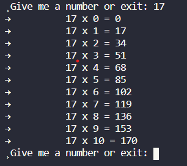

<h1 align='center'>Dev.to community posts</h1>

This repository contains all code base that I used to write my posts in <a href="https://dev.to/chseki">dev.to</a> community

## Usage :books:

- I create the branches with the name similar to the **title** of the post

## Running :scroll:

`go run main.go` and then interact with the cli:

---

This is a simple example of using channels, goroutines and the select statement in golang.

 

