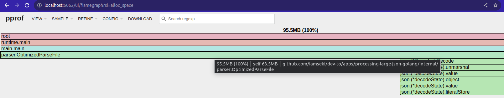
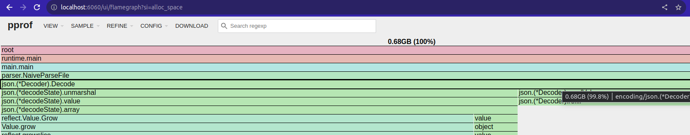

# Reading Large JSON Files Efficiently in Go: Naive vs. Chunked Approaches

This project demonstrates how to read a large JSON file using two different approaches in Golang. One approach loads the entire file into memory, while the other reads it in chunks using a buffered reader and JSON decoder. Check out the dev.to post: **[Handling Large JSON Files in Go: Naive vs. Chunked Approaches](https://dev.to/chseki/handling-large-json-files-in-go-naive-vs-chunked-approaches-4cel)**

## Generating the Large File

A script has been created to generate files of specific sizes. To generate a ~100MB file, execute:

- `yarn nx generate-file processing-large-json-golang --size=100`

## Executing and Collecting Profiling Data

We have two commands to run both approaches. Each command will also collect profiling data:

- For the naive approach: `yarn nx process-naive processing-large-json-golang --filename=largefile-20240718-083247-100mb.json`
- For the optimized approach: `yarn nx process-optimized processing-large-json-golang --filename=largefile-20240718-083247-100mb.json`

> **Note**: Use the filename generated in the previous step for the `--filename` argument. You can also use the default 1MB file by not passing the argument at all.

## Profiling Analysis

To analyze the profiling data, use the Golang tool `pprof` with the webserver command. More information about the ***[pprof web interface can be found here](https://github.com/google/pprof/blob/main/doc/README.md#web-interface-1)***.

- To analyze the memory profile of the optimized version: `yarn nx analyze-mem-optimized processing-large-json-golang`

- To analyze the memory profile of the naive version: `yarn nx analyze-mem-naive processing-large-json-golang`

